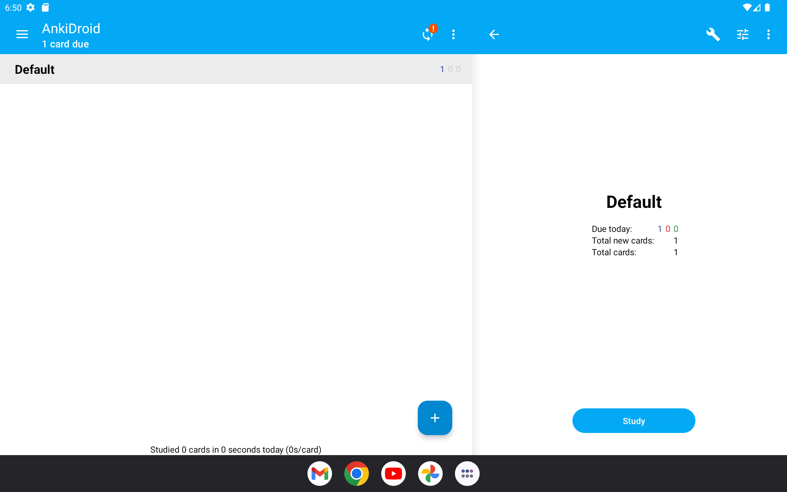
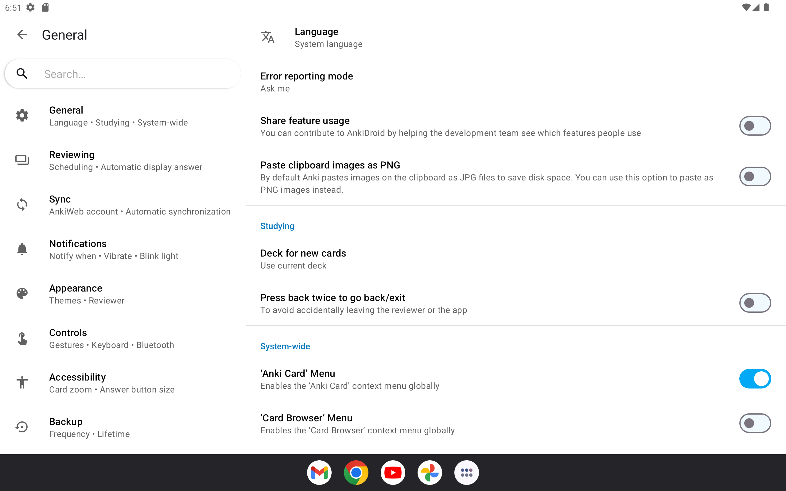
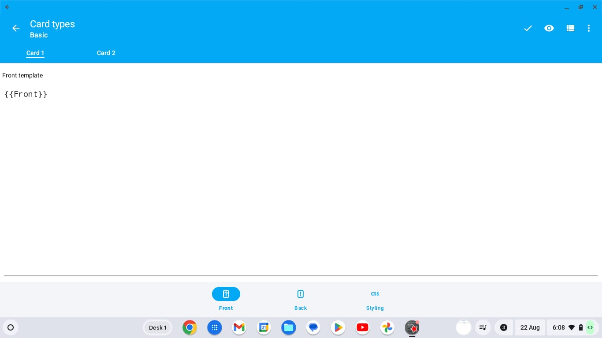
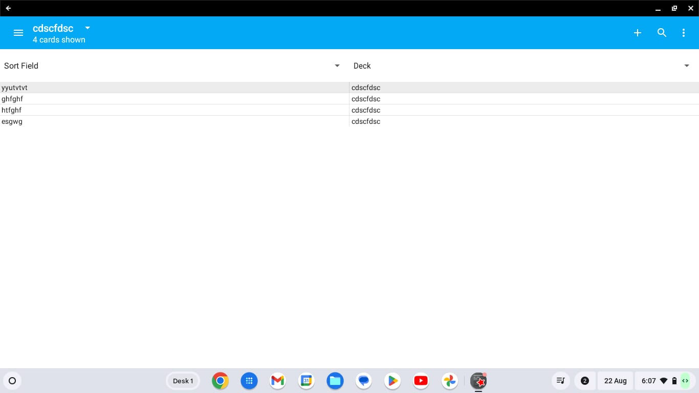

  

<h1 align="center">Sanjay Sargam</h1>
<h2 align="center">Tablet & Chromebook UI - Google Summer of Code 2024</h2>
<h3 align="center">
  <a href="https://github.com/ankidroid/Anki-Android">AnkiDroid</a>
</h3>

  <a href="http://github.com/SanjaySargam">GitHub</a> | 
  <a href="https://x.com/sanjay__sargam">Twitter</a> | 
  <a href="https://www.linkedin.com/in/sanjaysargam/">LinkedIn</a>

---

## 🧑‍🏫 Mentors
- [Arthur Milchior](https://github.com/Arthur-Milchior)
- [David Allison](https://github.com/david-allison)

---

## 📚 Project Overview

[**AnkiDroid**](https://github.com/ankidroid/Anki-Android) is an Android app for [Anki](https://github.com/ankitects/anki), a powerful flashcards application that aids in learning and memorizing various topics.

### 🎯 **Project Goal**
My work focuses on enhancing the user experience of AnkiDroid on larger devices like tablets and Chromebooks. The project aims to improve usability, readability, and overall aesthetics, ensuring AnkiDroid remains intuitive and efficient across various devices. Specific tasks include converting the DeckPicker screen to feature a unified menu, highlighting selected preference settings, integrating the NoteEditor into the CardBrowser, implementing a Previewer within the CardTemplateEditor, adding mouse support, and introducing keyboard shortcuts for efficient navigation and interaction. Throughout the proposal, a strong emphasis is placed on user-centric design and usability enhancements to elevate the overall AnkiDroid experience on tablets and Chromebooks.

---

## 🚀 Project Achievements

### 1. **Convert DeckPicker Screen to One Menu**

Unified the DeckPicker screen's menu for a streamlined user experience.

**Before:**

    

**After:**

    

### 2. **Highlight Selected Preference Setting**

Improved user experience by highlighting the selected preference setting.

**Before:**

    

**After:**

    

### 3. **Add TemplatePreviewerFragment to CardTemplateEditor**

Integrated a TemplatePreviewerFragment into the CardTemplateEditor for real-time preview of card templates, enhancing usability and efficiency.

**Before:**

    

**After:**

    

### 4. **Add NoteEditor to CardBrowser**

Incorporated the NoteEditor directly into the CardBrowser, making note editing more seamless.

**Before:**

    

**After:**

    

### 5. **Mouse Support (Right-Click)**

Added right-click functionality to areas with long-click listeners, enhancing user interactions on devices that support right-click actions.

### 6. **Drag and Drop in NoteEditor and DeckPicker**

- **NoteEditor**: Expanded the existing media drop functionality to support video and audio files, in addition to photos.
- **DeckPicker**: Enabled direct file import by dropping files into DeckPicker.

### 7. **Keyboard Shortcuts**

Introduced a wide range of keyboard shortcuts for faster navigation and operations. Also, added a dedicated dialog to display all available keyboard shortcuts.

    

---

## 📂 Pull Requests

Here's a list of the pull requests I created during GSoC 2024:

1. [Highlight selected preference setting](https://github.com/ankidroid/Anki-Android/pull/16368)
2. [Refactor DeckPicker to Single Menu Layout](https://github.com/ankidroid/Anki-Android/pull/16425)
3. [Add TemplatePreviewerFragment to CardTemplateEditor](https://github.com/ankidroid/Anki-Android/pull/16529)
4. [Remove back button if fragmented](https://github.com/ankidroid/Anki-Android/pull/16582)
5. [Refactor: Convert NoteEditor from Activity to Fragment](https://github.com/ankidroid/Anki-Android/pull/16597)
6. [DeckPicker: Implementation of Keyboard Shortcuts](https://github.com/ankidroid/Anki-Android/pull/16679)
7. [Add Right-Click Support to Long Click Listeners](https://github.com/ankidroid/Anki-Android/pull/16712)
8. [CardTemplateEditor: Implementation of Keyboard Shortcuts](https://github.com/ankidroid/Anki-Android/pull/16722)
9. [Enhancement of Media Drop Feature in NoteEditor](https://github.com/ankidroid/Anki-Android/pull/16749)
10. [Refactor: Consolidate media paths into a single variable](https://github.com/ankidroid/Anki-Android/pull/16750)
11. [Add NoteEditor to CardBrowser](https://github.com/ankidroid/Anki-Android/pull/16764)
12. [Rename pager](https://github.com/ankidroid/Anki-Android/pull/16783)
13. [CardBrowser: Implementation of Keyboard Shortcuts](https://github.com/ankidroid/Anki-Android/pull/16795)
14. [CardBrowser: Shortcut E](https://github.com/ankidroid/Anki-Android/pull/16814)
15. [Implement Keyboard Shortcuts Helper](https://github.com/ankidroid/Anki-Android/pull/16880)
16. [Enhancement of Files Drop Feature in DeckPicker](https://github.com/ankidroid/Anki-Android/pull/16881)

---

## 🏆 Outcome

This project successfully enhanced the AnkiDroid app, particularly for tablet and Chromebook users, by offering a more polished and user-friendly experience. The new features and improvements are expected to significantly improve productivity and accessibility for users on larger devices.

---

## 🔮 Future Work

I see potential for further refinements in keyboard and mouse interactions, along with additional optimizations for larger screens. I also plan to continue contributing to the AnkiDroid project, addressing community feedback and implementing new features.

---

*Thank you for following my GSoC journey! Feel free to connect with me on [GitHub](http://github.com/SanjaySargam), [Twitter](https://x.com/sanjay__sargam), or [LinkedIn](https://www.linkedin.com/in/sanjaysargam/).*
